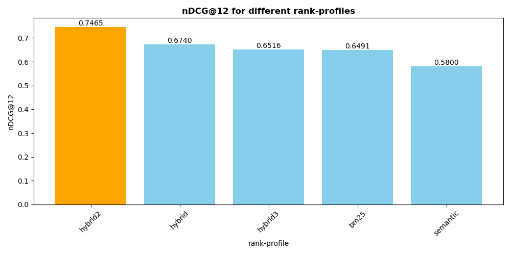

### RAG quality evaluation

Without evals, we are making changes blindly. 

### Basic evaluation for [search.vespa.ai](https://search.vespa.ai/) RAG engine

> I realized that if I get people to do their evals, they will stop asking me questions about the title boost or what embedding model I can recommend. They will just do their evals and see what works best for them. - [Jo Kristian Bergum](https://x.com/jobergum/status/1798451023159366055)


Query relevance dataset in [qrels](qrels.tsv) file.  Judged = 2 is relevant, Judged = 1 is semi-relevant, 0 is irrelevant.


```bash
pip3 install ir_datasets ir_measures
```

Run evaluation for 5 Vespa rank-profiles [paragraph.sd](../src/main/application/schemas/paragraph.sd), sorted by nDCG@12 (higher is better).

See simple evaluation script [evaluate_ranking.py](evaluate_ranking.py) for details.

```bash
python3 evaluate_ranking.py qrels.tsv hybrid,hybrid2,hybrid3,bm25,semantic
hybrid2: nDCG@12: 0.7465, R@12: 0.8291, Judged@12: 0.2276
hybrid: nDCG@12: 0.6740, R@12: 0.7618, Judged@12: 0.2019
hybrid3: nDCG@12: 0.6516, R@12: 0.7330, Judged@12: 0.1955
bm25: nDCG@12: 0.6491, R@12: 0.6954, Judged@12: 0.2212
semantic: nDCG@12: 0.5800, R@12: 0.7245, Judged@12: 0.1667
```
Judged gives us the percentage of judged documents in the top 12 results. We want to increase this number to increase the confidence in the ranking metrics.

The script also generates a ranking metrics plot.



